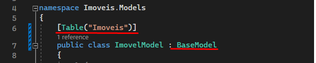

# Imoveis MVC

Este projeto faz parte das aulas ministradas na Etec Itu introduzindo o conceito de .NET MVC

Suas branchs representarão as aulas sequenciais para montagem do projeto, assim permitirão comparar cada aula com a sua subsequente.

Aqui serão abordados conceitos de: 
Classes
Enum
Entity Framework Core
Banco de dados Sql Server
Validação de entidades

## Aula 1
O modelo inicial do exercício é:
Crie um projeto ASP.NET MVC onde teremos entidade com 
Id: inteiro, auto numerado que será utilizado como código do imóvel
Tipo de imóvel (Casa, Apartamento, Terreno, Comercial, Rural)
Titulo : texto 80 caracteres
Valor: numero decimal
Descrição: texto livre
Tipo de anuncio (Aluguel / Venda )
Metragem do terreno: numero decimal
Metragem construída: numero decimal
Proprietário: texto 50 caracteres
Bairro: texto 50 caracteres
Cidade: texto 50 caracteres
Estado: texto 2 caracteres

Os campos: Tipo de Imóvel e Tipo de Anúncio deverão ser do tipo "Enum".

Aula II - Herança, definição de nome da tabela 

Iremos criar uma classe abstrata (não pode ser instanciada, apenas herdada) com nome BaseModel, para que toda classe criada a partir dela, já carregue propriedades que queremos inserir no banco de dados.

Também iremos alterar a classe ImovelModel para que passe a herdar as propriedades da classe BaseModel

